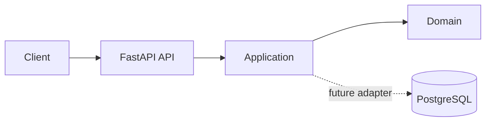

# Architecture Overview

The service exposes HTTP adapters in `api/`. Business use cases belong in `application/`, business rules in `domain/`, and external systems in `infrastructure/`. This first template uses an in-memory order store solely to validate the API shape; persistence is introduced when the requirement exists.

